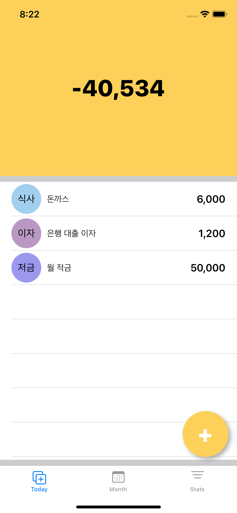
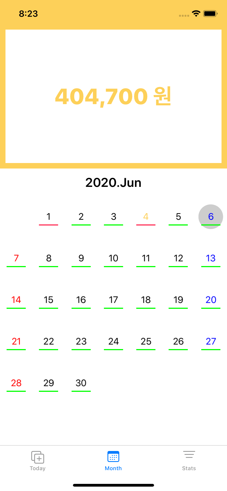
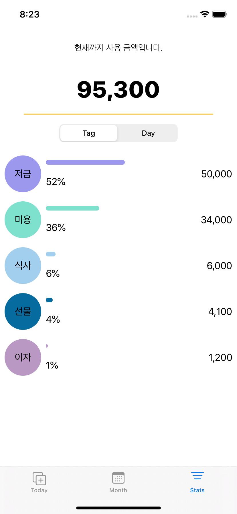
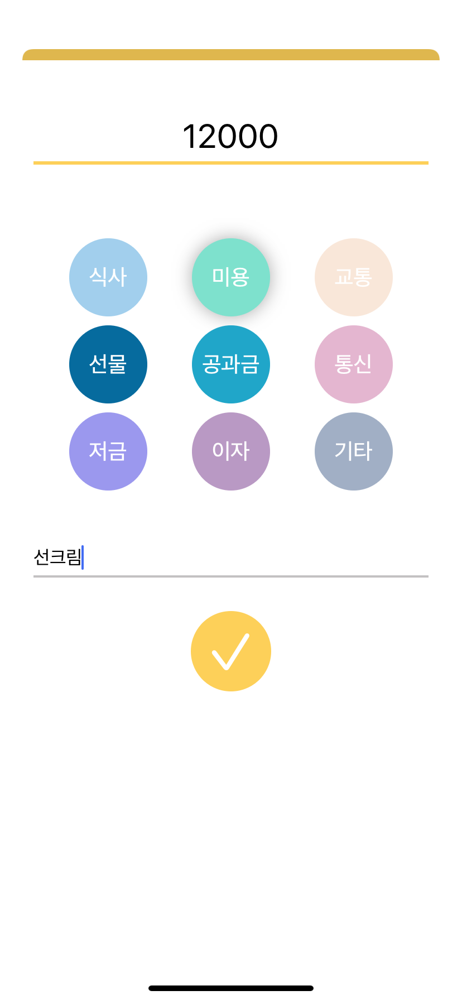
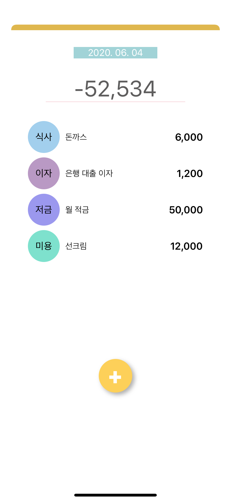
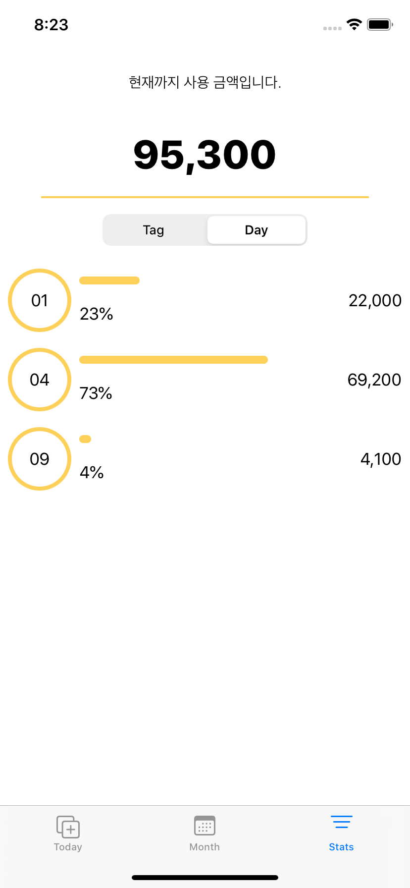

# Safe.Money.Guide

> 패스트캠퍼스에서 진행한 팀 해커톤 프로젝트

## Description

- 기능
  - 한 달 단위의 예산 설정
  - 예산 설정 시 하루 사용 가능한 금액 자동 계산
  - 하루 예산 초과시 달력에 빨간색 표시
  - 지출 기록에 따라 사용 가능한 금액 자동 계산
  - 지출 기록 시 태그를 달아 항목 별 지출 금액을 확인

- 기간: 2020.01.17(1일)
- 참여 인원: iOS 3명
- 사용 기술
  - Swift
  - UIKit
  - JTAppleCalendar
- 구현 파트
  - 어플 기획
  - 월별 부분 UI
  - 일별 부분 UI
  - 통계 부분 UI

## Implementation

|                    Today                     |                            Month                             |                        Stats                         |
| :------------------------------------------: | :----------------------------------------------------------: | :--------------------------------------------------: |
| 오늘 지출 내역  | 이번 달 남은 예산  예산 초과 한 눈에 보기  |   항목 별 통계     |
| 지출 입력  | 달력에서 날짜 클릭 시 해당 날짜 지출 기록, 추가 가능   | 날짜 별 지출 금액  |

